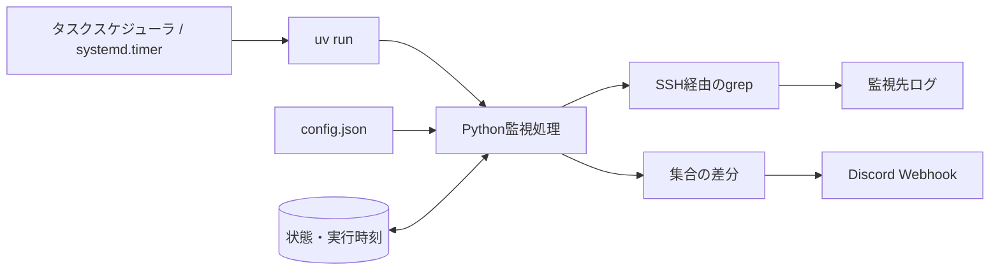

# Cowrieログ差分通知システム 仕様書

作成日: 2026-09-24  
対象: cowrie-discord 0.1.0／作成時点の実装・設定

## 1. 目的と対象範囲

SSHで取得したCowrieログの抽出結果を前回の結果と比較し、新しいコマンド、ファイル転送記録、接続元などをDiscordへ通知する。

監視単位を **check** と呼ぶ。checkごとに対象ファイル、正規表現、実行間隔、削除通知、全員メンションの有無を設定する。Cowrie固有のイベント解析は行わず、正規表現で抽出できる他のログにも適用できる。

本システムは常駐しない。Windowsタスクスケジューラまたはsystemd.timerが5分毎に起動し、実行対象のcheckを処理して終了する。厳密な時刻指定、イベント発生直後の通知、バイナリ内容の解析は対象外とする。

## 2. 構成と動作環境

| 構成要素 | 役割・要件 |
|---|---|
| 実行ホスト | WindowsまたはLinux。Python 3.10以降をuvで実行 |
| Python実行時依存 | 標準ライブラリのみ。mypyは開発用依存 |
| OpenSSHクライアント | 実行ユーザーのSSH設定・鍵・known_hostsを使用 |
| 監視先 | POSIXシェルと `grep -P` が使用でき、対象ファイルを読み取れるホスト |
| Discord | HTTPSのIncoming Webhook URLを環境変数で提供 |
| ローカルディスク | 状態、排他ロック、実行ログを保存 |
| Windows非表示起動 | Windows Script HostとVBScriptが使用可能であること |



SSH接続先は設定ファイル全体で一つ。checkは設定順に直列実行し、同じファイルを参照するcheckもそれぞれ読み直す。

## 3. 外部インターフェース

### 3.1 コマンドライン

```powershell
uv run --locked cowrie_monitor.py
uv run --locked cowrie_monitor.py --config "C:\path\config.json"
uv run --locked cowrie_monitor.py --dry-run
```

| オプション | 動作 |
|---|---|
| `--config PATH` | 設定JSONのパス。省略時はスクリプトと同じディレクトリの `config.json` |
| `--dry-run` | 間隔判定・SSH取得・差分の件数出力を実施。Discord送信、比較用データ更新、実行時刻更新は行わない |
| `-h`, `--help` | ヘルプを表示して終了 |

dry-runでも実行ログとロックファイルは作成される。実行間隔を無視して全checkを強制実行する機能はない。

### 3.2 環境変数

既定の変数名は `DISCORD_WEBHOOK_URL`。`webhook_env` で変数名を変更できる。全checkが同じWebhookを使用する。

URLは実際に通知が必要になった時点で参照する。変数未設定でも、通知しない初回の基準値作成、差分なし、スキップ、dry-runは実行できる。URLを設定JSONやコマンドライン引数に埋め込まない。

## 4. 設定仕様

設定ファイルはUTF-8のJSONとし、BOM付きUTF-8も読み取る。未知のキーは現実装では無視されるため、キー名の誤記は自動検出されない。

### 4.1 共通設定

| キー | 型 | 必須／既定値 | 意味 |
|---|---|---|---|
| `ssh` | object | 必須 | 共通SSH設定 |
| `ssh.host` | string | 必須 | SSHホスト名またはSSH configのエイリアス。空文字・NUL・先頭の `-` は不可 |
| `ssh.executable` | string | `ssh` | SSH実行ファイル名またはパス |
| `ssh.timeout_seconds` | number | `90` | SSHサブプロセス全体のタイムアウト秒。正数、boolean不可 |
| `state_file` | string | `state/snapshots.json` | 比較用データ・実行時刻の保存先 |
| `log_file` | string | `logs/monitor.log` | 実行ログの保存先 |
| `webhook_env` | string | `DISCORD_WEBHOOK_URL` | Webhook URLを格納する環境変数名 |
| `notify_initial` | boolean | `false` | 初回・監視条件変更時の既存抽出値を通知するか |
| `checks` | array | 必須、1件以上 | checkの配列 |

`state_file` と `log_file` の相対パスは設定ファイルのディレクトリ基準。`ssh.executable` はOSの実行ファイル検索に従うため、確実な指定には絶対パスを使用する。

### 4.2 check設定

| キー | 型 | 必須／既定値 | 意味 |
|---|---|---|---|
| `name` | string | 必須 | 状態管理のキー。check間で一意、1～120文字、改行・NUL不可 |
| `file` | string | 必須 | 監視先ホスト上の対象ファイル。絶対パスを推奨 |
| `regex` | string | 必須 | GNU grepの `-P` で使用するPCRE正規表現 |
| `notify_removed` | boolean | `true` | 前回存在し今回消えた値も通知するか |
| `interval_seconds` | integer | `300` | 最小実行間隔。0以上。0は起動ごとに実行 |
| `mention_everyone` | boolean | `false` | 差分投稿の先頭に `@everyone` を付けるか |

文字列項目は空文字とNULを許可しない。booleanの代わりに文字列 `"true"` や整数1を指定することはできない。間隔には負数・小数・文字列・boolean・nullを指定できない。

正規表現はマッチ全体を抽出する。キャプチャグループのみの抽出ではない。後読みはPCREの範囲で使用できる。JSON文字列内のバックスラッシュは二重に記述する。

### 4.3 公開用設定例

`config.example.json` を `config.json` にコピーして使用する。実際の `config.json` はGit管理対象外とする。例の共通SSHホストは `cowrie-host`、対象ファイルは全checkで `/opt/cowrie/var/log/cowrie/audit.log`。利用環境に合わせて変更する。

| name | regex | interval_seconds | notify_removed | mention_everyone |
|---|---|---:|---|---|
| commands | `CMD.+$` | 0 | false | false |
| uploads | `(Saved\|SFTP).+$` | 0 | false | false |
| source-addresses | `(?<=New connection: )[^:]+` | 0 | false | false |

表のuploadsの正規表現は選択演算子 `|` を使用する。初回通知は無効。運用設定の正本は `config.json` とする。

## 5. 実行間隔の判定

各checkを処理する直前の時刻を取得し、次の条件で実行する。

```text
現在時刻 − 前回の実行開始時刻 >= interval_seconds
```

| 条件 | 動作 |
|---|---|
| 間隔0 | 起動ごとに1回実行。常駐・ループ実行はしない |
| 指定間隔未経過 | SSHへ接続せずスキップ。残り秒数をログ出力 |
| 時刻の記録なし | 即実行 |
| ホスト・ファイル・正規表現が変更された | 即実行し、新しい監視条件として処理 |
| 時計が前回開始時刻より過去に戻った | 即実行し、現在時刻を新しい基準として記録 |
| 長時間停止していた | 起動時に1回だけ実行。停止中の回数分は実行しない |

開始時刻はUTCのUnix秒として、SSH実行前に永続化する。SSH失敗、通知失敗、途中停止も実行として扱う。間隔0なら次回起動で、正の間隔なら経過後の起動で再試行する。

OSの起動間隔が5分でもcheckの300秒経過は保証されない。起動の揺れや先行checkの処理時間の違いにより299秒程度しか経過していないと、次の起動までスキップする。**OSの毎回の起動で実行したい場合は0を明示する。** 900秒などOS間隔の整数倍でも同じ制約がある。

## 6. 取得と差分検知

### 6.1 SSH取得

監視先で以下の形式のコマンドを実行する。正規表現とファイル名はシェル用にクォートする。

```sh
LC_ALL=C grep -a -oP -e '正規表現' -- '対象ファイル'
```

現在の実装は当初の `grep -oE` から `-oP` に変わっている。PCREに対応したgrepが必要。`-a` によりバイナリ判定を避け、Cロケールでマッチさせる。

SSHオプションは以下とする。

| オプション | 値・目的 |
|---|---|
| `-T` | 疑似端末を割り当てない |
| `BatchMode` | yes。パスワード等の対話入力を行わない |
| `StrictHostKeyChecking` | yes。未登録・不一致のホスト鍵を拒否 |
| `ConnectTimeout` | 15秒 |
| `ServerAliveInterval` | 15秒 |
| `ServerAliveCountMax` | 2回 |

SSH／grepの終了コード0・1を正常として扱う。1はマッチなしの空集合。それ以外とタイムアウトは取得失敗とし、比較用データを更新しない。

### 6.2 集合比較

取得結果をUTF-8でデコードし、改行で分割、空文字を除外、重複排除、ソートする。不正なUTF-8バイトは `surrogateescape` で保存・比較時に保持する。

```text
追加 = 今回の集合 − 前回の集合
削除 = 前回の集合 − 今回の集合
```

順序や同一値の出現回数は比較しない。同じコマンドの繰り返しや同じ接続元の再接続だけでは通知しない。`notify_removed: false` でも今回の集合へ更新するため、一度消えた値が再出現すると追加扱いになる。

初回は既定で取得値を基準として保存するだけ。`notify_initial: true` の場合は取得値を追加として通知し、送信成功後に保存する。

## 7. Discord通知

### 7.1 投稿内容

check名とdiff形式のコードブロックを投稿する。追加は `+`、削除は `-`。削除通知を無効にしたcheckでは削除行を投稿しない。

差分本文は750文字単位で分割し、各投稿にcheck名とコードブロックを付ける。行の途中で分割する場合がある。表示用に不正バイトをエスケープし、バッククォートを類似文字へ置換する。保存・比較用の値は変更しない。

### 7.2 メンション

`mention_everyone: true` の場合、checkの最初の投稿にだけ `@everyone` を付け、`allowed_mentions.parse` を `["everyone"]` にする。その他の投稿は空配列とする。

check名・差分本文の全 `@` の後ろにゼロ幅文字を挿入し、ログ由来のメンションを無効化する。ユーザー・ロールメンションは許可しない。分割後の再送では最初の投稿とメンションが重複する場合がある。

通知音・プッシュ通知をメンションだけに絞る設定はDiscordクライアント側で行う。チャンネルを「メンションのみ」にし、サーバーの「@everyoneと@hereを抑制」をオフにする。Webhookから受信者個人の通知設定を変更する機能はない。

### 7.3 通信と再試行

HTTPSでPOSTし、URLの `wait` を `true` に設定する。他の通常のクエリパラメーターは維持する。リダイレクトは追従しない。1リクエストのタイムアウトは30秒、HTTP 200を成功とする。

| エラー | 処理 |
|---|---|
| HTTP 429 | `retry_after` が解釈可能なら採用。なければ既定待機時間を使用 |
| HTTP 5xx | 原則1秒、2秒の待機後に再試行 |
| 429の待機時間が0～30秒の範囲外 | その起動での再試行を打ち切る |
| その他のHTTPエラー | その起動での再試行を行わない |
| 接続エラー・タイムアウト | その起動での再試行を行わない |

最大3回の送信試行を行う。失敗したcheckは比較用データを更新せず、指定間隔を経過した後の起動で改めて取得・比較する。通知専用キューはなく、送信失敗中に監視対象ログから消えた一時的な値の通知は保証しない。

## 8. 状態保存と設定変更

状態JSONの `version` は1。以下の構造を持つ。

```json
{
  "version": 1,
  "checks": {
    "commands": {
      "source": "監視条件のSHA-256値",
      "values": ["CMD: example"]
    }
  },
  "last_runs": {
    "commands": {
      "source": "監視条件のSHA-256値",
      "started_at": 1790244000.0
    }
  }
}
```

`source` はSSHホスト・対象ファイル・正規表現の配列をJSON化し、SHA-256で識別したもの。check名は外側のキーとして使用する。

| データ | 更新タイミング |
|---|---|
| `last_runs` | 通常実行のSSH取得前。時刻保存に失敗したcheckはSSH取得に進まない |
| `checks` | 取得成功後、必要な全投稿が成功した時点。投稿不要の場合は取得・比較後 |

同じディレクトリに一時ファイルを作り、flush・fsync後に `os.replace` で置換する。状態が破損している場合はエラーとし、自動的な初期化・上書きは行わない。旧形式で `last_runs` が存在しない場合は、比較用データを維持して即実行する。

| 設定変更 | 状態への影響 |
|---|---|
| 新しいname | 新しいcheckとして初回処理 |
| ホスト・ファイル・正規表現 | 新しい監視条件として即実行・基準値を作成 |
| 実行間隔のみ | 前回開始時刻を引き継ぎ、新しい間隔で判定 |
| 削除通知・メンション・初回通知設定 | 既存の基準値・時刻を維持 |
| checkを削除 | 実行対象から外れる。保存済みエントリーは自動削除しない |
| 状態ファイルを削除・別の未作成パスに変更 | 全checkが初回扱い |

送信後・状態保存前に停止した場合や、複数投稿の途中で失敗した場合は重複通知があり得る。厳密な一度だけの配送は保証しない。

## 9. 排他・ログ・終了コード

状態ファイルに `.lock` を付けたファイルでOSロックを取得する。Windowsは `msvcrt`、Linuxは `fcntl` を使用し、処理全体を排他する。取得できない場合は実行をスキップする。プロセス終了時にOSがロックを解放するため、ロックファイル自体は残してよい。

check単位の取得・通知・保存エラーはログ出力し、残りのcheckを継続する。設定・状態の読み込み失敗は実行全体を中止する。全checkがスキップされた場合は成功扱い。

| 終了コード | 意味 |
|---|---|
| 0 | 正常終了、間隔未経過、または重複起動スキップ |
| 1 | 捕捉対象の設定・状態・取得・通知・保存エラー |
| 2 | argparseによる不正なCLI引数。非表示ランチャーでも引数不正等に使用 |

実行ログは日時・レベル・check名・件数・追加削除件数・スキップ残秒・エラー概要を出力する。ファイルは2,000,000バイトを閾値としてローテーションし、現行1本とバックアップ3本を保持する。標準エラーにも出力するが、Windows非表示実行ではファイルで確認する。

## 10. OSからの起動

### 10.1 Windows

タスク名の例は `cowrie`。ログオン中のみ実行する方式で、5分毎に `wscript.exe` から `deploy/run_hidden.vbs` を呼び出す。以下のプロジェクトパスと `<USER>` は利用環境に合わせて置き換える。

```text
プログラム: C:\Windows\System32\wscript.exe
引数: //B //Nologo "C:\path\to\cowrie-discord\deploy\run_hidden.vbs" "C:\Users\<USER>\.local\bin\uv.exe"
開始: C:\path\to\cowrie-discord
```

ランチャーはプロジェクトへ移動し、`uv run --locked cowrie_monitor.py` を非表示で起動する。uvの終了を待ち、その終了コードを返す。任意の追加引数には対応せず、動作確認用の `--dry-run` だけを受け付ける。

画面ロック中はログオンが維持されるため実行対象。サインアウト中は実行しない。環境変数・SSH鍵等は実行ユーザーから利用可能である必要がある。

`deploy/enable_hidden_task.ps1` は起動処理の変更用補助スクリプト。変更前のタスクXMLをstateディレクトリへ保存し、ログオン方式・トリガー・Settingsが維持されていることを確認する。タスク変更には管理者権限が必要となる場合がある。

### 10.2 Linux

`deploy/cowrie-discord.service` と `deploy/cowrie-discord.timer` は移植用テンプレートとする。

- serviceは `Type=oneshot`、ユーザー `monitor`、作業ディレクトリ `/opt/cowrie-discord`。
- `/etc/cowrie-discord.env` から環境変数を読む。
- uvで `--offline --locked` を指定して実行。事前に同じユーザーで環境を準備する。
- serviceの最大起動時間は30分、UMaskは0077。
- timerは5分境界、`Persistent=true`、`AccuracySec=1s`。
- ユーザー・uvのパス・SSH設定は移植先に合わせる。Windowsの `.venv` はコピーしない。

## 11. 制約と非対応事項

- ログ全体を毎回読み、抽出結果と集合をメモリへ保持する。差分追記読み込み、複数check間の取得共有、並列実行は行わない。
- ローテーション・切り詰めにより集合から値が消える。監視間隔内に書かれて消えた値は検知できない。
- バイナリの転送ログは監視できるが、実際のファイル内容・ハッシュは検証しない。
- IPアドレス・ユーザー名等の意味解析は行わない。現在の接続元正規表現は最初のコロンまでを抽出するため、IPv6を完全に扱うものではない。
- タイムスタンプ・セッションIDを抽出に含めると、それらの違いでも新規値と判定される。
- checkごとのSSHホスト、Webhook、ロールメンション、通知キュー、失敗専用のDiscord通知は未対応。
- 別の状態ファイルを使う複数ホスト間の排他・状態共有は行わない。
- OSの休止・停止・ユーザーのサインアウト中の即時実行は保証しない。

## 12. 開発・検証要件

Pythonコードとテストは厳密な型チェックを必須とし、uv経由で実行する。`Any`、型チェック除外、抑制コメント、設定緩和にはユーザーの事前許可が必要。外部データは `object` として受け取り、実行時に検証して型付きデータクラスへ変換する。

```powershell
uv run --locked mypy --platform win32
uv run --locked mypy --platform linux
uv run --locked -m unittest discover -v
```

主な検証対象は、集合差分、初回処理、通知失敗時の比較用データ保持、間隔0、間隔境界、check別間隔、失敗時の間隔、旧状態の引き継ぎ、時計の巻き戻り、設定検証、排他、分割投稿、意図したメンションのみの許可である。

型チェックのLinux指定はLinuxでの実行試験を代替しない。ユニットテストのSSH・Discord通信は差し替えであり、実送信試験とは区別する。

## 13. 関連ファイル

| ファイル | 内容 |
|---|---|
| `cowrie_monitor.py` | 監視・間隔判定・状態保存・通知 |
| `config.example.json` | 公開用設定例 |
| `config.json` | 各環境で作成する運用設定。Git管理対象外 |
| `test_cowrie_monitor.py` | 自動テスト |
| `pyproject.toml` / `uv.lock` | 環境・依存・型チェック設定 |
| `deploy/` | Windows非表示起動、タスク変更、systemdテンプレート |
| `README.md` | 導入・運用手順 |
| `AGENTS.md` | 開発上の必須ルール |
| `.github/workflows/ci.yml` | Windows／Linux、Python 3.10／3.14での型チェック・テスト |

この仕様書は作成時点の実装を記述する。運用設定を変更した場合はconfigを正本とし、仕様変更時は実装・テスト・本書を合わせて更新する。
